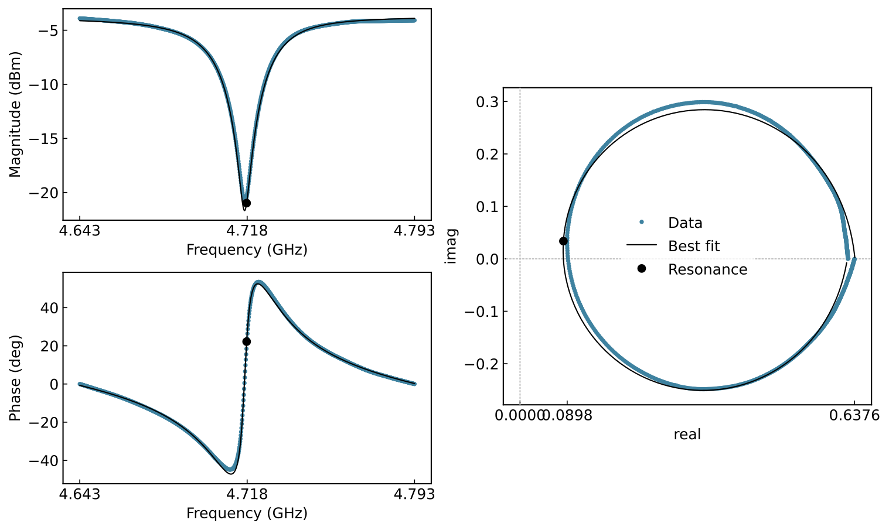
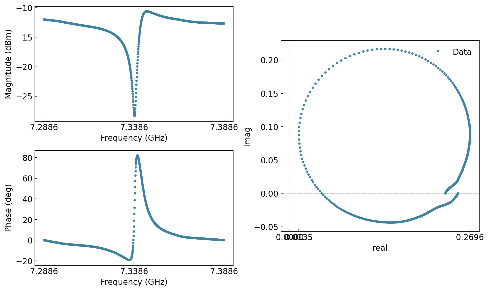
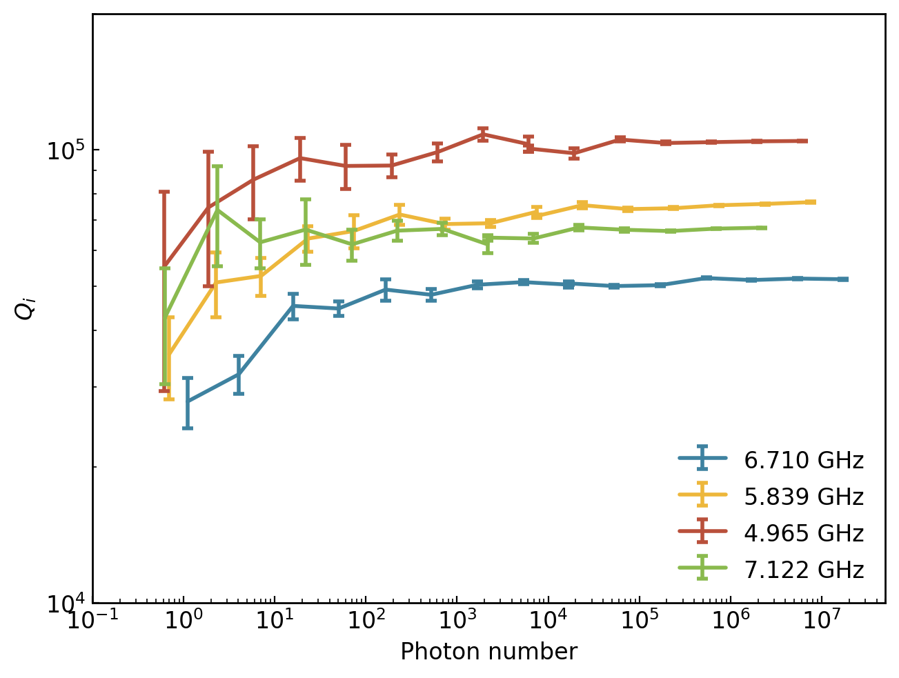
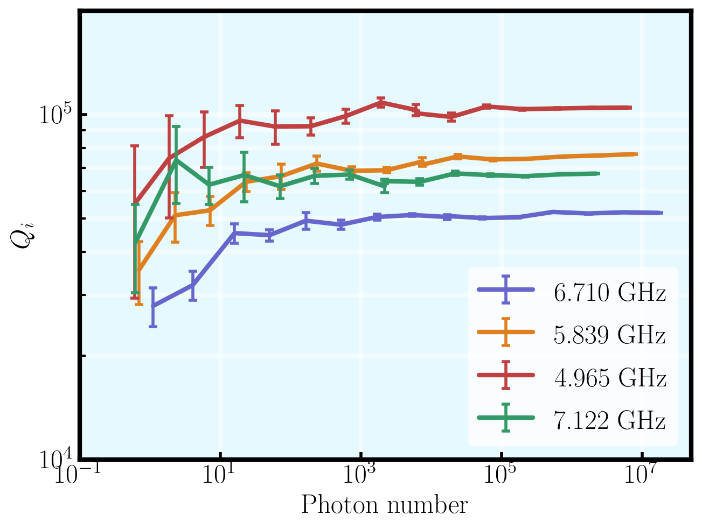

Usage Examples
==============

Fitting Resonator Data
----------------------

To fit resonator data, we first need to input this data into a :class:`Dataset <ooragan.Dataset>`. The Dataset takes care of reading the data files provided those are either HDF5 generated by MeaVis or TXT files generated by PyHegel. Here is how we load data:

.. code::
    
    import ooragan as ra

    my_dataset = ra.Dataset("path/to/my/folder/", attenuation_cryostat=-80)

This code will load the data files contained in the specified directory (``"path/to/my/folder/"``), meaning it will visit all sub-path contained in this path. Note that in the case where you have both TXT and HDF5 files in the directory, the ``file_extension`` must be specified when creating a Dataset. This code will then print informations about what file it has found and what they contain.

.. code::

    Found 4 files
    Files :
      1. path/to/my/folder/file_1.hdf5
      2. path/to/my/folder/file_2.hdf5
      3. path/to/my/folder/file_3.hdf5
      4. path/to/my/folder/file_4.hdf5
    File infos :
      File no.  Start time             Start freq. (GHz)    Stop freq. (GHz)  Power (dB)                             Mixing temp. (K)
    ----------  -------------------  -------------------  ------------------  -----------------------------------  ------------------
             1  2023-08-29 22:14:04              5.35653             5.36653  -100.0, -90.0, -80.0, -70.0                   0.0154368
             2  2023-08-31 01:48:44              4.89003             4.89053  -100.0, -90.0, -80.0, -70.0                   0.0136144
             3  2023-10-02 09:12:53              2                  18        -110.0, -100.0, -90.0, -80.0, -70.0
             4  2023-11-05 03:04:30              5.95844             5.96844  -110.0, -100.0, -90.0, -80.0                  0.0142297

Also note that in some cases, depending on the specific files, some information can be missing from this table as it is either not present in the data file or the code could not locate it.

To fit this data, we then create a :class:`ResonatorFitter <ooragan.ResonatorFitter>` object.

.. code::

    my_fitter = ra.ResonatorFitter(my_dataset)
    my_fitter.fit(file_index=[1, 2], power=[-100, -90, -80], write=True, savepic=True, showpic=False)

The second line is where the fit is executed and you'll note that we have specified the ``file_index`` and ``power`` arguments to cherry-pick only certain data to fit. Those arguments are optional and if omitted, the complete Dataset will be fitted. We have also specified the options ``write=True`` which saves a TXT file per sweep fitted containing the fit results. Here is an example of such a file:

.. code::

  7_338GHz_-70.0_dBm

  ------------------------------------------

  Q_c : 1293.9341493826892

  Q_c_err : 9.015616452644894

  Q_i : 7213.528197761625

  Q_i_err : 261.000764589943

  Q_t : 1097.1345028346557

  Q_t_err : 8.858086965646569

  L_c : 0.0007728368560927777

  L_c_err : 5.384818600177224e-06

  L_i : 0.00013862841768751973

  L_i_err : 5.015870461498165e-06

  L_t : 0.0009114652737802975

  L_t_err : 7.359023565891362e-06

  f_r : 7341356793.587177

  f_r_err : 22764.58925547969

  photon_number : 829180.3584670528

  input_power : -70.0

All those entries also exist as attributes of the ResonatorFitter object and can be used to extract the fit results. We could, for example, get all internal quality factors by using ``my_fitter.Q_i``. This would return a dictionnary of the files and associated :math:`Q_i`.

The options ``savepic=True`` and ``showpic=False`` mean that a figure of the resulting fit is saved but not displayed. Here is the figure of a fit:

.. note:: For the fitting methods used and for an exhaustive list of all fit parameters, please refer to :py:meth:`ooragan.ResonatorFitter.fit`.

Plotting Results and Raw Data
-----------------------------

OORAGAN also allows us to generate multiple predefined plots, either from raw data (directly from a :class:`Dataset <ooragan.Dataset>`) or from fitted data (from a :class:`ResonatorFitter <ooragan.ResonatorFitter>`). In both cases, the same factory function (:func:`grapher <ooragan.grapher>`) is used to create the Grapher object. Let us start with plotting raw data from our previous Dataset:

.. code::

  raw_grapher = ra.grapher(my_dataset)

We now have a :class:`DatasetGrapher <ooragan.graphing.DatasetGrapher>` object on which we can call methods to generate plots. Here are the available plots for raw resonator data:

- Magnitude versus frequency
- Phase versus frequency
- Complex signal
- Triptych (all three of the above plots combined, this is the same plot as the one generated for fit results)

Here is an example of plotting a triptych:

.. code::

  raw_grapher.plot_triptych(file_index=[1], power=[-70], three_ticks=True)

   
.. note:: For more information on the available options for the DatasetGrapher's plotting methods, see :class:`DatasetGrapher <ooragan.graphing.DatasetGrapher>`.
   
Now, let us plot some results from a previously fitted Dataset. As done previously, we create a Grapher object, in this case a :class:`ResonatorFitterGrapher <ooragan.graphing.ResonatorFitterGrapher>`, using the :func:`grapher <ooragan.grapher>` function:

.. code::

  fit_grapher = ra.grapher(my_fitter)

We can then generate one of the following predefined plots:

- Resonance frequency versus power
- Frequency shift versus power
- Coupling quality factor versus power
- Internal quality factor versus power
- Total quality factor versus power
- Internal loss versus power

Here is an example of plotting the internal quality factor versus the number of photons :

.. code::

    # Load data in a Dataset
    fname = "/my_data/my_sample"
    dataset = ra.Dataset(
        fname,
        -80,
        print_out=True,
    )

    # Fit data
    fitter = ra.ResonatorFitter(dataset)
    fitter.fit(
        file_index=[1, 2, 3, 4, 6, 7, 8, 9],
        savepic=False,
        showpic=False,
        write=False,
        nodialog=True,
        threshold=0.5,
    )

    # Match files corresponding to the same measured resonance
    match_dict = {
        "5.474 GHz": (1, 6),
        "6.033 GHz": (2, 7),
        "7.161 GHz": (3, 8),
        "7.122 GHz": (4, 9),
    }

    # Create the grapher and plot the Qi vs the photon number
    grapher = ra.grapher(fitter, save_graph_data=True, match_pattern=match_dict)
    grapher.plot_Qi_vs_power(
        photon=True, y_lim=(8e3, 2e5), legend_loc="outside center right", save=True
    )

Here we also used the ``match_pattern`` argument to display a single curve for multiple data files corresponding to the same resonance at different power ranges. We have also used the option ``save_graph_data`` to generate a CSV file of the data in the plot. This file can be loaded afterwards using the :func:`load_graph_data <ooragan.load_graph_data>` function. To customize the plot itself there are a few arguments we can use directly. For further customization, see `Customizing Plots`_.

Analysing PPMS Data
-------------------

.. note::
  
  This section is a work in progress. Please refer to :class:`PPMSAnalysis <ooragan.PPMSAnalysis>` for help with PPMS data analysis.

Customizing Plots
-----------------

Plot generated in OORAGAN are using the `GraphingLib <https://graphinglib.org/>`_ library and every plotting method returns a `GraphingLib Figure <https://www.graphinglib.org/latest/generated/graphinglib.Figure.html#graphinglib.Figure>`_ object. This object can be used to further customize the plot by using methods implemented for Figure objects. Here is an example of a customization we can do:

.. code::

    fig = grapher.plot(
        photon=True, y_lim=(8e3, 2e5), legend_loc="outside center right", save=True
    )

    for element in fig._elements:
        element._line_width = 3
        element._errorbars_line_width = 2
        element._cap_thickness = 2
    fig.set_visual_params(
        use_latex=True,
        font_family="serif",
        font_size=18,
        axes_face_color="#E6F9FF",
        color_cycle=["#6666cc", "#df8020", "#bf4040", "#339966"],
        axes_line_width=3,
    )
    fig.set_rc_params({"xtick.major.width": 2, "ytick.major.width": 2, "xtick.major.size": 5, "ytick.major.size": 5, "xtick.minor.width": 1.5, "ytick.minor.width": 1.5, "xtick.minor.size": 4, "ytick.minor.size": 4})
    fig.set_grid(which_x="major", color="white", line_width=3)
    fig.show()
    

.. warning:: To obtain this exact result, matplotlib **must** have access to an installation of LaTeX on your computer.
